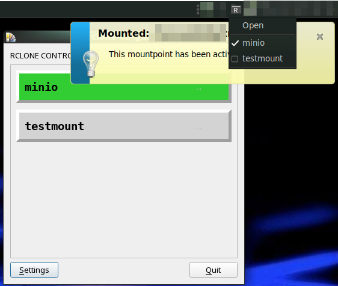

RCLONE-CONTROL-GUI
==================

A minimalistic **rclone gui** with a tray icon.
---

This program allows you to configure mountpoints for Rclone connections.
Each configured connection can be mounted with a click.

More
----

That's it, really. Maybe some features will be added later to also
configure Rclone connections. And to set the base path of the remote.
But for now, this is an experimental tool.

Author
------

Philip Seeger (philip@c0xc.net)

License
-------

Please see the file called LICENSE.

